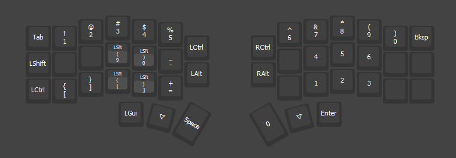

# corne-vial-config

Este repositorio contiene mi configuración para el teclado Corne v4 utilizando [Vial](https://get.vial.today/).

## Descripción

Aquí encontrarás el archivo de configuración principal (`takemichi-keyboard.vil`) y las imágenes de cada layer que he configurado para mi teclado. Estas imágenes muestran la distribución de teclas para cada capa, facilitando la visualización y referencia rápida.

## Capas configuradas

A continuación se muestran las imágenes correspondientes a cada layer:

### Layer 0

### Layer 1

### Layer 2

### Layer 3

## Archivos

- `takemichi-keyboard.vil`: Archivo de configuración para Vial.
- Carpeta `layers/`: Imágenes de las capas configuradas.

## Uso

1. Abre Vial y carga el archivo `takemichi-keyboard.vil` para aplicar esta configuración a tu Corne v4.
2. Consulta las imágenes en la carpeta `layers` para ver la distribución de cada layer.